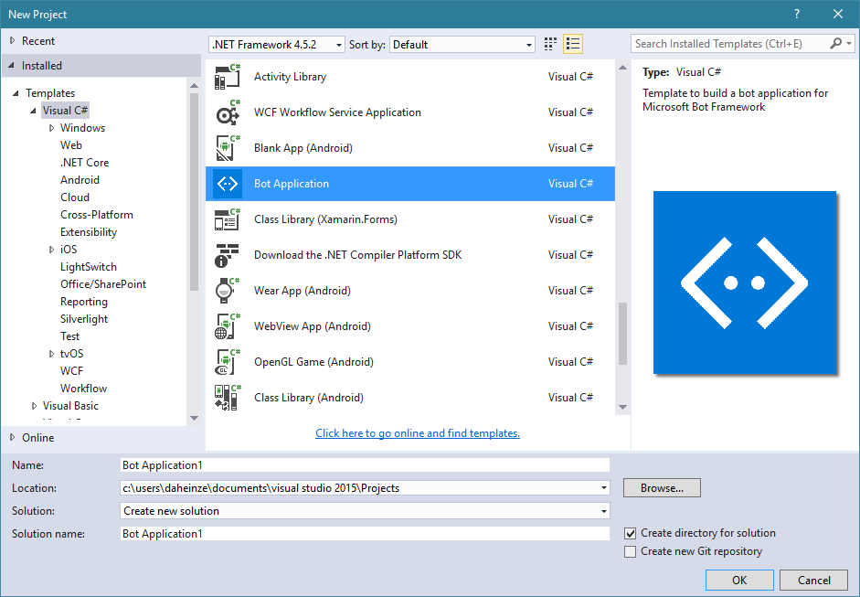

# Basic Echo Bot - Bot Builder

In this lab, we will get to know the basics of building your first bot: A simple Echo Bot. 

It is quite limited in its potential, because it just answers with the message, that is send to it (with some additional information).

## Instructions

1. At first, I you haven't done this yet, please download the [Visual Studio IDE](https://www.visualstudio.com/vs/) in your preferred edition (the link refers to VS Community, which is completely free).

1. After Visual Studio was successfully installed, you want to download and include the [Bot Template for C#](http://aka.ms/bf-bc-vstemplate). To set it up to appear in Visual Studio, save the downloaded .zip file in the following path: "%USERPROFILE%\Documents\Visual Studio 2015\Templates\ProjectTemplates\Visual C#\" (replace %USERPROFILE% with your PC username)

1. Create a new project in Visual Studio with the Template 

1. [Optional] Set up source control for your project. The [GitHub extension for Visual Studio](https://visualstudio.github.com/) might come in handy here :-)

1. Open the solution and take a look at the file: controllers/MessagesController.cs 
'''C# 
using System;
using System.Linq;
using System.Net;
using System.Net.Http;
using System.Threading.Tasks;
using System.Web.Http;
using System.Web.Http.Description;
using Microsoft.Bot.Connector;
using Newtonsoft.Json;

namespace $safeprojectname$
{
    [BotAuthentication]
    public class MessagesController : ApiController
    {
        /// 

        /// POST: api/Messages
        /// Receive a message from a user and reply to it
        /// 

        public async Task<HttpResponseMessage> Post([FromBody]Activity activity)
        {
            if (activity.Type == ActivityTypes.Message)
            {
                ConnectorClient connector = new ConnectorClient(new Uri(activity.ServiceUrl));
                // calculate something for us to return
                int length = (activity.Text ?? string.Empty).Length;

                // return our reply to the user
                Activity reply = activity.CreateReply($"You sent {activity.Text} which was {length} characters");
                await connector.Conversations.ReplyToActivityAsync(reply);
            }
            else
            {
                HandleSystemMessage(activity);
            }
            var response = Request.CreateResponse(HttpStatusCode.OK);
            return response;
        }

        private Activity HandleSystemMessage(Activity message)
        {
            if (message.Type == ActivityTypes.DeleteUserData)
            {
                // Implement user deletion here
                // If we handle user deletion, return a real message
            }
            else if (message.Type == ActivityTypes.ConversationUpdate)
            {
                // Handle conversation state changes, like members being added and removed
                // Use Activity.MembersAdded and Activity.MembersRemoved and Activity.Action for info
                // Not available in all channels
            }
            else if (message.Type == ActivityTypes.ContactRelationUpdate)
            {
                // Handle add/remove from contact lists
                // Activity.From + Activity.Action represent what happened
            }
            else if (message.Type == ActivityTypes.Typing)
            {
                // Handle knowing tha the user is typing
            }
            else if (message.Type == ActivityTypes.Ping)
            {
            }

            return null;
        }
    }
}

'''
