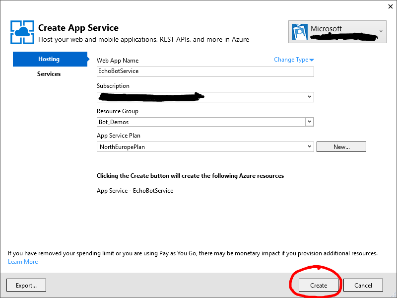

# Basic Echo Bot - Bot Builder #

In this lab, we will get to know the basics of building your first bot: A simple Echo Bot. 

It is quite limited in its potential, because it just answers with the message, that is send to it (with some additional information).

## Setting up the bot ##

1. At first, I you haven't done this yet, please download the [Visual Studio IDE](https://www.visualstudio.com/vs/) in your preferred edition (the link refers to VS Community, which is completely free).

1. After Visual Studio was successfully installed, you want to download and include the [Bot Template for C#](http://aka.ms/bf-bc-vstemplate). To set it up to appear in Visual Studio, save the downloaded .zip file in the following path: "%USERPROFILE%\Documents\Visual Studio 2015\Templates\ProjectTemplates\Visual C#\" (replace %USERPROFILE% with your PC username)

1. Create a new project in Visual Studio with the Template 
    
    

1. [Optional] Set up source control for your project. The [GitHub extension for Visual Studio](https://visualstudio.github.com/) might come in handy here :-)

1. Open the solution and take a look at the file: controllers/MessagesController.cs. 

    ```C# 
    using System;
    using System.Linq;
    using System.Net;
    using System.Net.Http;
    using System.Threading.Tasks;
    using System.Web.Http;
    using System.Web.Http.Description;
    using Microsoft.Bot.Connector;
    using Newtonsoft.Json;

    namespace EchoBotProject
    {
        [BotAuthentication]
        public class MessagesController : ApiController
        {
            /// <summary>
            /// POST: api/Messages
            /// Receive a message from a user and reply to it
            /// </summary>
            public async Task<HttpResponseMessage> Post([FromBody]Activity activity)
            {
                if (activity.Type == ActivityTypes.Message)
                {
                    ConnectorClient connector = new ConnectorClient(new Uri(activity.ServiceUrl));
                    // calculate something for us to return
                    int length = (activity.Text ?? string.Empty).Length;

                    // return our reply to the user
                    Activity reply = activity.CreateReply($"You sent {activity.Text} which was {length} characters");

                    await connector.Conversations.ReplyToActivityAsync(reply);
                }
                else
                {
                    HandleSystemMessage(activity);
                }
                var response = Request.CreateResponse(HttpStatusCode.OK);
                return response;
            }

            private Activity HandleSystemMessage(Activity message)
            {
                if (message.Type == ActivityTypes.DeleteUserData)
                {
                    // Implement user deletion here
                    // If we handle user deletion, return a real message
                }
                else if (message.Type == ActivityTypes.ConversationUpdate)
                {
                    // Handle conversation state changes, like members being added and removed
                    // Use Activity.MembersAdded and Activity.MembersRemoved and Activity.Action for info
                    // Not available in all channels
                }
                else if (message.Type == ActivityTypes.ContactRelationUpdate)
                {
                    // Handle add/remove from contact lists
                    // Activity.From + Activity.Action represent what happened
                }
                else if (message.Type == ActivityTypes.Typing)
                {
                    // Handle knowing tha the user is typing
                }
                else if (message.Type == ActivityTypes.Ping)
                {
                }

                return null;
            }
        }
    }
    ```
1. The bot is now set up to work in the way expected: It will calculate the length of the message, that is sent to it and returns: "You sent {activity.Text} which was {length} characters". You can test this behaviour with the [Bot Framework Emulator](https://emulator.botframework.com/). If you encounter any issues with the emulator, take a look at the [Emulator Wiki Page](https://github.com/microsoft/botframework-emulator/wiki/Getting-Started)

## Publishing ##

1. To publish the bot to use it in the channels we want, we need to create an Azure App Service. Fortunately, this is build right into Visual Studio. Just right-click on the project and choose "Publish". For this we need an Microsoft Azure Account. You can get a free account wtih 25$ of monthly credit from [Visual Studio Dev Essentials](https://www.visualstudio.com/dev-essentials/).

    
    
1. Select the Azure App Service and click "New" on the right side of the window. This will create a new Azure Service, which you can then modify and create, by clicking "Create" on the bottom of the page.

    
    
    

    

1. After Publishing your bot by clicking Publish, your are now able to [Register your bot](https://dev.botframework.com/bots/new) on the Bot Framework Website. The next steps will lead you through this.

## Connecting your bot to channels ##

1. By clicking the [Register your bot](https://dev.botframework.com/bots/new) link, you will be directed to a website, where you can define the values of your bot. These are needed to connect it to the channels in the future. For Messaging endpoint use a URL that looks like this: https://YOUR_BOT_NAME.azurewebsites.net/api/messages

    

1. To finish the process, click on "Create Microsoft App ID and password" and store the values for App ID and Password, as we will need them in the next steps.

1. Now save your bot, click on "Register" on the bottom of the page.

1. Before you can use your bot, update the web.config in Visual Studio with the App ID and Password and publish it again.

    

1. After you have done this, you can see your bots web page, where you can test it, add new channels and publish it for the world to use. 
    
    

## Further Steps ##

1. To learn about other bots, try out the tutorials on [Form Flow Bot](https://github.com/Danielius1012/BotLabs/tree/master/Bot_Builder/2_Form_Flow_Bot) or [LUIS Bot](https://github.com/Danielius1012/BotLabs/tree/master/Bot_Builder/3_LUIS_Bot)

1. If you want to get to know a even more agile and Cloud optimized way to develop a bot, check out the labs on the [Azure Bot Service](https://github.com/Danielius1012/BotLabs/tree/master/Azure_Bot_Service)