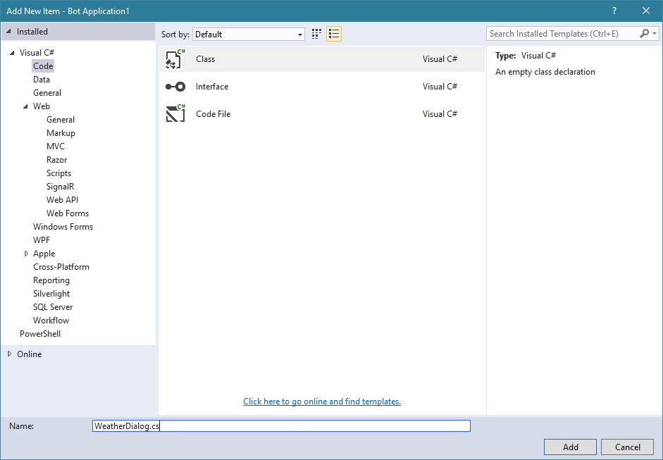
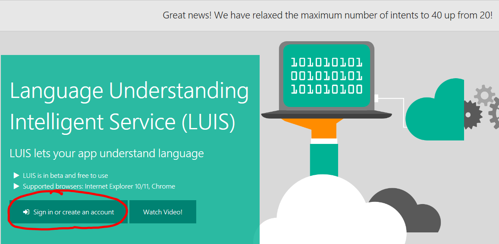
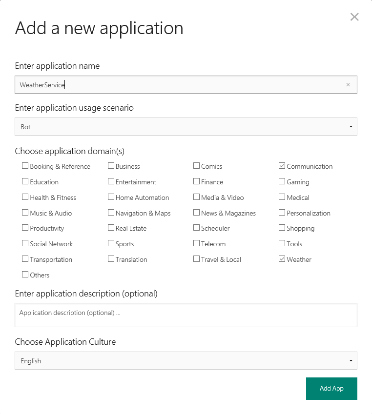
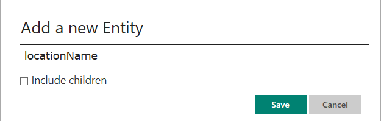
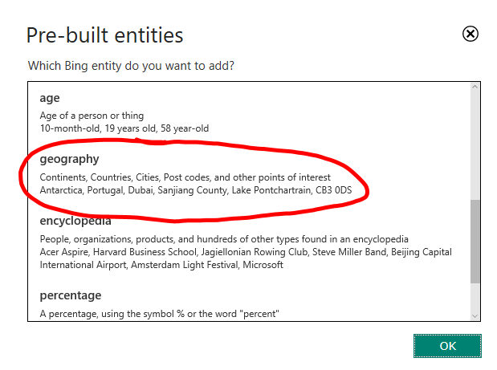
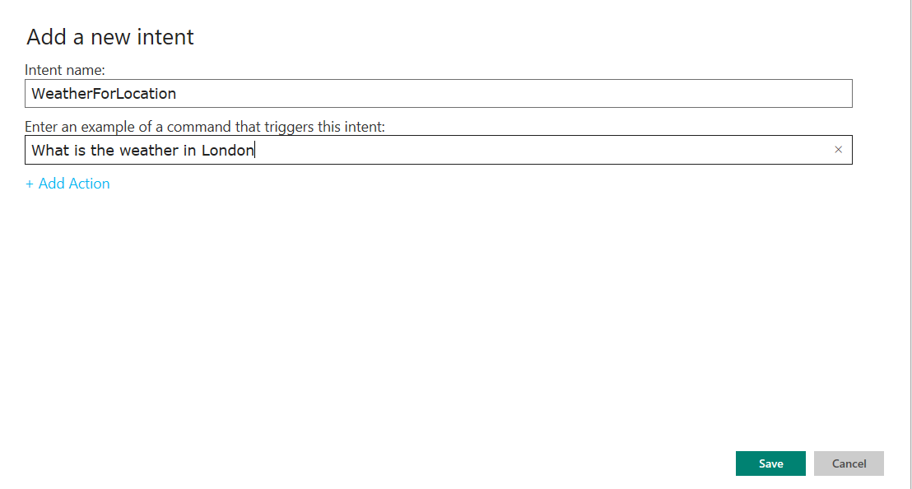
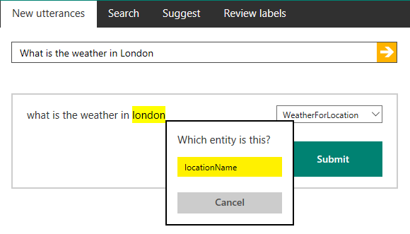
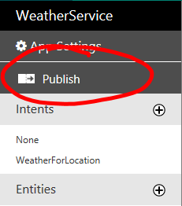
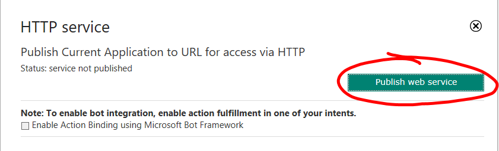
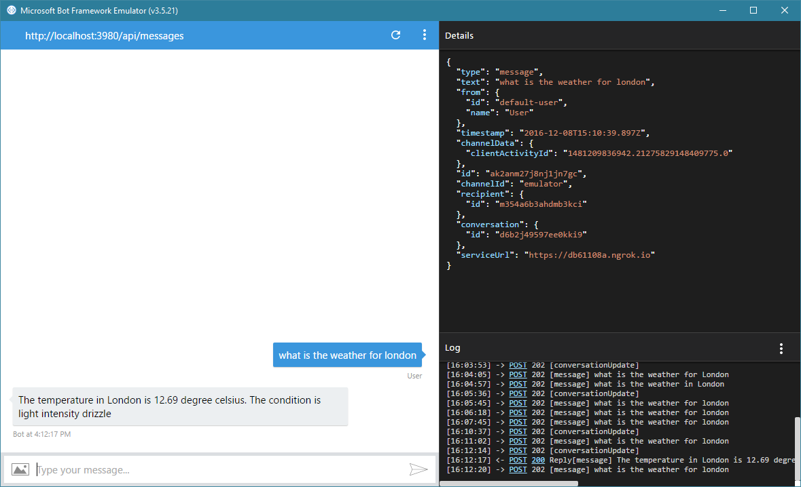

# LUIS Bot - Bot Builder

In this lab, we will create a bot that can learn and take over the world - more or less. What it can do though, is using the Machine Learning capabilities of the [LUIS Service](http://luis.ai) to learn phrases from the user and extract his/her intentions and entities used in the phrase. We will train it to be able to tell us the weather in any given city, using the API form [Open Weather Map](http://openweathermap.org/).

We will not cover how to publish or register your bot. To learn more about publishing and registration, take a look at the [Basic Echo Bot](https://github.com/Danielius1012/BotLabs/tree/master/Bot_Builder/1_Basic_Echo_Bot).

## Setting up the LUIS bot ##

1. **[Optional]** If you don't know how to create a bot project in Visual Studio, take a look at the [Basic Echo Bot](https://github.com/Danielius1012/BotLabs/tree/master/Bot_Builder/1_Basic_Echo_Bot) for instructions how to do this and come back after finishing the "Setting up the bot" chapter.

1. Create a new project called **WeatherBot** using the echo bot template.

1. To create a LUIS Bot from the template of the echo bot example, we have to send the message from the user to the LUIS service. Fortunately, the Bot Buider comes with LUIS support build in. To handle the service we create a new class, called **WeatherDialog.cs** in the **Controllers** directory.

    

    This dialog will be handling the message to LUIS and the response from the service. Every time LUIS sends a response, the intent will trigger a pre-defined method. Additionally, entities can be used to extract features from the user query. 

1. Replace the code in the newly created file with the code below to get started with the LUIS service:

    ```csharp
    using Microsoft.Bot.Builder.Dialogs;
    using Microsoft.Bot.Builder.Luis.Models;
    using System;
    using System.Threading.Tasks;

    namespace WeatherrBot.Controllers
    {
        [Serializable]
        public class WeatherDialog : LuisDialog<object>
        {
            [LuisIntent("")]
            public async Task None(IDialogContext context, LuisResult result)
            {
                string message = $"Sorry I did not understand: {result.Query}";
                await context.PostAsync(message);
                context.Wait(MessageReceived);
            }        
        }
    }
    ```

## Train the LUIS service ##

1. To hook the code up to the LUIS service, we have to create a service first. To do this, we go to the [LUIS website](https://www.luis.ai/) and log in with a Microsoft account.

    

1. In the following view called **My Applications** we create a new application, by clicking "New Application"

    

1. Fill out the information for the new service and click "Add App"

    

1. The service is then created and you are redirected to the model training screen:

    

    For this lab we will concentrate on the intents and entities on the left side of the screen. 

1. We will now create a simple intent and entity. Lets start by adding an entity by clicking on the '+' next to it. We will call this entity **locationName** to get the location from the user's query.

    

1. **[Side Note]** To use already trained entity recognition, we can take advantage of the Pre-built entities. Just click on the '+' next to "Pre-built Entities" and pick geography.

    

    We will not look at this option any further, because we want to get through the process of training the entity ourselves. It is very useful though, because it detects many different formats without training.

1. Afterwards, we create an intent to capture the intention of getting the weather for a specific location. A query can look like "What is the weather in London?". We create a new intent by clicking the '+' next to the Intents panel.

    

1. After this, the query is displayed in the middle of the page, but it doesn't use our entity yet. Let's change this by clicking the location name (in this case London) and choosing the entity 'locationName' and then click submit.

    

1. By inserting queries into the text field we can train the model to recognize other query formats and the already existing ones even better. Type 5 queries inside the text field (individually) and annotate them as shown before (highlighting the location, picking the intent from the dropdown). Click 'Submit' after every annotation.

1. After annotation, the model needs to be trained, which can be done by clicking 'Train' in the bottom left corner of the page.

    

1. We can now publish the LUIS application by clicking 'Publish' right above the intents. 

    

    

1. After publishing, the url of the service will appear and you will be able to test your service with the displayed url. **We need this query for later to authenticate our bot to communicate with the LUIS service.**

1. Now the service is ready to detect our queries, so lets connect it to the Bot. **Note: Any time you add queries to the service, you need to re-train and re-publish your service for the changes to take effect.**
 
## Connect to the LUIS service ##

1. So let's get back to our bot and open the **WeatherDialog.cs** file. We have to add our credentials to connect the dialog to our LUIS application. Add the following 2 things:

    1. Import library

        ```csharp
        using Microsoft.Bot.Builder.Luis;
        ```

    1. Attribute of the WeatherDialog class:

        ```csharp
        [LuisModel("a5baea7f-7714-4c56-a13a-ea8b631d55ab", "a2afc4ddd6b540fe8e36d62cea3629f3")]
        ```
        Replace the first string with the modelId of your service and the second string with the subscription key of your service. You can get these values from the recently stored url on the LUIS publish dialog. A this url can look like this: 
        
        **https//api.projectoxford.ai/luis/v2.0/apps/a5baea7f-7714-4c56-a13a-ea8b631d55ab?subscription-key=a2afc4ddd6b540fe8e36d62cea3629f3&verbose=true** 
        
        (first uuid is the modelId)

1. Additionally, we need to add the entity placeholders and the method routing for the newly created intent:

    1. Add the entity placeholder:

        ```csharp
        public const string Entity_Location = "locationName";
        ```

    1. Add the intent method

        ```csharp
        [LuisIntent("WeatherForLocation")]
        public async Task WeatherForLocation(IDialogContext context, LuisResult result)
        {
            EntityRecommendation location;
            if (result.TryFindEntity(Entity_Location, out location))
            {
                // Call to the OpenWeatherMap API
                var message = await WeatherAPICaller.GetWeatherData(location.Entity, context.MakeMessage().Recipient.Id);
                await context.PostAsync(message);
            }
            else
            {
                string m = $"Cannot get weather for unknown location. Try again with a query like: What is the weather in London";
                await context.PostAsync(m);
            }

            context.Wait(MessageReceived);
        }
        ```

1. The final **WeatherDialog** should now look like this:

    ```csharp
    using Microsoft.Bot.Builder.Dialogs;
    using Microsoft.Bot.Builder.Luis;
    using Microsoft.Bot.Builder.Luis.Models;
    using System;
    using System.Threading.Tasks;

    namespace WeatherBot.Controllers
    {
        // LUIS Url: https://api.projectoxford.ai/luis/v2.0/apps/a5baea7f-7714-4c56-a13a-ea8b631d55ab?subscription-key=a2afc4ddd6b540fe8e36d62cea3629f3&verbose=true

        [Serializable]
        [LuisModel("a5baea7f-7714-4c56-a13a-ea8b631d55ab", "a2afc4ddd6b540fe8e36d62cea3629f3")]
        public class WeatherDialog : LuisDialog<object>
        {
            public const string Entity_Location = "locationName";

            [LuisIntent("")]
            public async Task None(IDialogContext context, LuisResult result)
            {
                string message = $"Sorry I did not understand: {result.Query}";
                await context.PostAsync(message);
                context.Wait(MessageReceived);
            }

            [LuisIntent("WeatherForLocation")]
            public async Task WeatherForLocation(IDialogContext context, LuisResult result)
            {
                EntityRecommendation location;
                if (result.TryFindEntity(Entity_Location, out location))
                {
                    // Call to the OpenWeatherMap API
                    var message = await WeatherAPICaller.GetWeatherData(location.Entity, context.MakeMessage().Recipient.Id);
                    await context.PostAsync(message);
                }
                else
                {
                    string m = $"Cannot get weather for unknown location. Try again with a query like: What is the weather in London";
                    await context.PostAsync(m);
                }

                context.Wait(MessageReceived);
            }
        }
    }


    ```

    **Comment** This will not compile, because of the missing WeatherAPICaller class. We will create this in the next chapter.

## Connect Bot to Weather API ##

1. After connecting to LUIS and handling getting the location out of it, it is now time to connect to the [OpenWeatherMap API](http://openweathermap.org/). 

    **To finish this session, you need to create an account there, get an API key and then come back to this lab.**

1. At first, let's create a new class called **WeatherAPICaller** and put it in the Controllers folder.

1. To get started, import the following libraries:

    ```csharp
    using Newtonsoft.Json;
    using System;
    using System.IO;
    using System.Net;
    using System.Threading.Tasks;
    ```

1. The first thing would be to put together the API call to **OpenWeatherMAP**. To do this, paste the following code into the WeatherAPICaller class:

    ```csharp
    public static async Task<string> GetWeatherData(string city, string channel)
    {
        const string API_KEY = "59325e03afe7tyfn42cda746dbf1246f";

        var urlBase = $"http://api.openweathermap.org/data/2.5/weather?";
        var callURL = $"{urlBase}q={city}&appid={API_KEY}";

        string weatherAnswer = await CallWeatherAPI(callURL, channel);
        return weatherAnswer;
    }
    ```

1. To call the constructed URL, we need to do a GET request. To keep this seperated, we create a new method and paste it inside the WeatherAPICaller class:

    ```csharp
    private static async Task<string> CallWeatherAPI(string url, string channel)
    {
        try
        {
            // Send JSON to endpoint
            WebRequest request = WebRequest.Create(url);
            request.Method = "GET";
            WebResponse response = await request.GetResponseAsync();

            // Handle Response from endpoint
            var dataStream = response.GetResponseStream();
            StreamReader reader = new StreamReader(dataStream);
            string responseFromServer = reader.ReadToEnd();

            // Deserialize JSON
            var infos = JsonConvert.DeserializeObject<WeatherData>(responseFromServer);

            string output = ComposeWeatherAnswer(infos, channel);

            // Clean up the streams.
            reader.Close();
            dataStream.Close();
            response.Close();

            return output;
        }
        catch (Exception e)
        {
            var error = e;
            return "No weather data available.";
        }
    }
    ```

1. As you see, the JSON we get back from the service has to be deserialized. To do this, we create a new folder called Objects on the same level as the Controllers folder and create a new object in there, called WeatherData.cs. 

1. Now, let's take a look at the JSON, that is returned from a request for London:

    ```Json
    {
        "coord": {
            "lon": -0.13,
            "lat": 51.51
        },
        "weather": [
            {
                "id": 300,
                "main": "Drizzle",
                "description": "light intensity drizzle",
                "icon": "09d"
            },
            {
                "id": 701,
                "main": "Mist",
                "description": "mist",
                "icon": "50d"
            }
        ],
        "base": "stations",
        "main": {
            "temp": 285.69,
            "pressure": 1020,
            "humidity": 93,
            "temp_min": 285.15,
            "temp_max": 286.15
        },
        "visibility": 10000,
        "wind": {
            "speed": 7.2,
            "deg": 200
        },
        "clouds": {
            "all": 75
        },
        "dt": 1481205000,
        "sys": {
            "type": 1,
            "id": 5187,
            "message": 0.0038,
            "country": "GB",
            "sunrise": 1481183631,
            "sunset": 1481212302
        },
        "id": 2643743,
        "name": "London",
        "cod": 200
    }
    ```

    We can take away a few things from this data: 

    - Temperature is in Kelvin (or it is really hot in London), so we have to convert it later
    - We can get information like pressure, humidity, wind speed and degree and even an icon

1. If we now copy the whole JSON and go to our WeatherData.cs file, we can generate an object out of it, that is needed for deserialization. To do this, we let Visual Studio help us. Just type 'json' into the **Quick Launch** bar (**Ctrl+Q**) and choose '**Paste JSON as classes**'. The structure is then put into the class. The only thing we have to change is to replace **Rootobject** with **WeatherData**. Now this class will look as follows:

    ```csharp
    using System;
    using System.Collections.Generic;
    using System.Linq;
    using System.Web;

    namespace WeatherBot.Objects
    {

        public class WeatherData
        {
            public Coord coord { get; set; }
            public Weather[] weather { get; set; }
            public string _base { get; set; }
            public Main main { get; set; }
            public int visibility { get; set; }
            public Wind wind { get; set; }
            public Clouds clouds { get; set; }
            public int dt { get; set; }
            public Sys sys { get; set; }
            public int id { get; set; }
            public string name { get; set; }
            public int cod { get; set; }
        }

        public class Coord
        {
            public float lon { get; set; }
            public float lat { get; set; }
        }

        public class Main
        {
            public float temp { get; set; }
            public int pressure { get; set; }
            public int humidity { get; set; }
            public float temp_min { get; set; }
            public float temp_max { get; set; }
        }

        public class Wind
        {
            public float speed { get; set; }
            public int deg { get; set; }
        }

        public class Clouds
        {
            public int all { get; set; }
        }

        public class Sys
        {
            public int type { get; set; }
            public int id { get; set; }
            public float message { get; set; }
            public string country { get; set; }
            public int sunrise { get; set; }
            public int sunset { get; set; }
        }

        public class Weather
        {
            public int id { get; set; }
            public string main { get; set; }
            public string description { get; set; }
            public string icon { get; set; }
        }

    }
    ```

1. When we go back to WeatherAPICaller.cs file, we have to include the new WeatherData file by adding: 

    ```csharp
    using WeatherBot.Objects;
    ```

1. The last thing we have to do now, is to create an answer out of this information. Therefor we create the method **ComposeWeatherAnswer** inside the WeatherAPICaller as follows:

    ```csharp
    private static string ComposeWeatherAnswer(WeatherData infos, string channel)
    {
        try
        {
            // convert the temperature to Celsius | Alternative for Fahrenheit: var temperature = infos.main.temp * 9.0f/5.0f - 459.67f
            var temperature = infos.main.temp - 273.15f;
            var location = infos.name;
            var condition = infos.weather[0].description;

            var message = $"The temperature in {location} is {temperature} degree celsius. The condition is {condition}";

            return message;
        }
        catch (Exception)
        {
            return $"The current weather can not be returned.";
        }
    }
    ```

1. To finish our whole pipeline form receiving the message from the user to answering we have to do one last step - connect the **MessageController** to the **WeatherDialog**. To do this we replace the code form **MessageController.cs** with the following code:

    ```csharp
    using System.Net.Http;
    using System.Threading.Tasks;
    using System.Web.Http;
    using Microsoft.Bot.Connector;
    using Microsoft.Bot.Builder.Dialogs;

    namespace WeatherBot.Controllers
    {
        [BotAuthentication]
        public class MessagesController : ApiController
        {
            /// <summary>
            /// POST: api/Messages
            /// Receive a message from a user and reply to it
            /// </summary>
            public async Task<HttpResponseMessage> Post([FromBody]Activity activity)
            {
                if (activity.Type == ActivityTypes.Message)
                {
                    await Conversation.SendAsync(activity, () => new WeatherDialog());
                }
                else
                {
                    HandleSystemMessage(activity);
                }
                return new HttpResponseMessage(System.Net.HttpStatusCode.Accepted);
            }

            private Activity HandleSystemMessage(Activity message)
            {
                if (message.Type == ActivityTypes.DeleteUserData)
                {
                    // Implement user deletion here
                    // If we handle user deletion, return a real message
                }
                else if (message.Type == ActivityTypes.ConversationUpdate)
                {
                    // Handle conversation state changes, like members being added and removed
                    // Use Activity.MembersAdded and Activity.MembersRemoved and Activity.Action for info
                    // Not available in all channels
                }
                else if (message.Type == ActivityTypes.ContactRelationUpdate)
                {
                    // Handle add/remove from contact lists
                    // Activity.From + Activity.Action represent what happened
                }
                else if (message.Type == ActivityTypes.Typing)
                {
                    // Handle knowing tha the user is typing
                }
                else if (message.Type == ActivityTypes.Ping)
                {
                }

                return null;
            }
        }
    }
    ```
    This includes the Dialog library needed for the call and the actual call inside the Post method.

1. We can now test and publish our bot. To see, how publishing works, go take a look at the last chapters of the [Basic Echo Bot](https://github.com/Danielius1012/BotLabs/tree/master/Bot_Builder/1_Basic_Echo_Bot) lab. A test result should look like this:

    

## Further Steps ##

1. To learn about another way to program bots, try the [Form Flow Bot](https://github.com/Danielius1012/BotLabs/tree/master/Bot_Builder/2_Form_Flow_Bot) lab.

1. If you want to get to know a even more agile and Cloud-optimized way to develop a bot, check out the labs on the [Azure Bot Service](https://github.com/Danielius1012/BotLabs/tree/master/Azure_Bot_Service)

